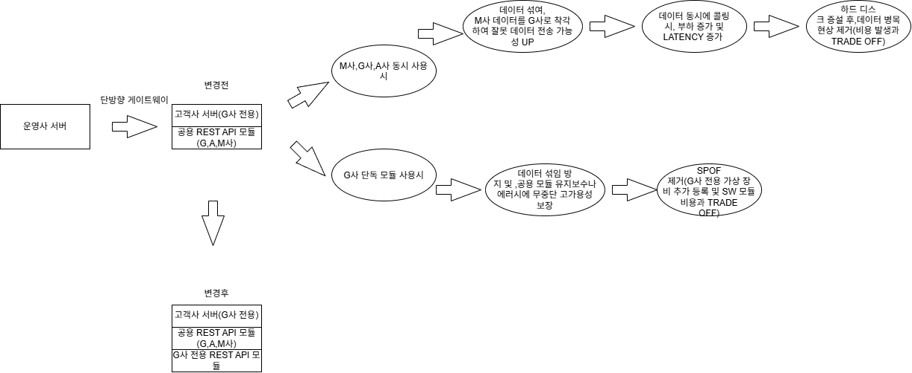

# infrastructure-troubleshooting-log
System architecture designs and troubleshooting logs
# 🏢 Multi-Tenant API Data Isolation & High Availability Design

## 📌 프로젝트 개요 (Overview)
다중 테넌트(Multi-Tenant) 환경에서 공용 REST API 모듈을 사용할 때 발생하는 **데이터 혼재 리스크, 동시 요청 부하, 그리고 고가용성(High Availability) 확보**를 위해 수행한 아키텍처 설계 및 트레이드오프(Trade-off) 검토 기록입니다.

---

## 🎯 1. 배경 및 과제 (Background & Challenge)
* **초기 구조:** G사, M사, A사 등 다수 테넌트가 단일 **공용 REST API 모듈**을 통해 데이터를 요청 및 수집하는 구조.
* **발생한 문제점 및 요구사항:**
  * **데이터 보안 및 격리:** G사 측에서 타 테넌트(M, A사)와 데이터가 섞이는 것을 원천적으로 거부함.
  * **고가용성 확보:** 공용 REST API 모듈에 장애가 발생하더라도 G사는 서비스 중단 없이 정상적으로 데이터 값을 받아올 수 있는 구조(SPOF 제거)가 필요함.
  * **동시 부하 리스크:** M사가 G사 전용 서버의 REST API를 통해 대량의 데이터를 동시에 수집할 때 발생하는 네트워크 레이턴시(지연 시간) 및 서버 부하를 해결해야 함.

---

## ⚖️ 2. 트레이드오프 분석 및 아키텍처 의사결정 (Trade-off & Decision)
모든 문제를 한 번에 해결할 수 없으므로, **비용 증가와 성능 최적화 사이의 트레이드오프**를 분석하여 다음과 같이 아키텍처를 수립했습니다.

### ① G사 관점: 보안 및 고가용성 우선 (Trade-off: 비용 증가 vs 무중단 신뢰성)
* **의사결정:** 추가적인 인프라 구축 비용이 발생하더라도, **G사 전용 REST API 모듈 및 가상 장비를 독립적으로 추가 구축**함.
* **기대 효과:** 
  * 타 테넌트와의 데이터 혼재(Crosstalk) 가능성을 원천 차단 (Fault Isolation).
  * 공용 모듈에 장애가 발생해도 G사 전용 모듈을 통해 무중단 데이터 수신 보장.

### ② M사 관점: 성능 및 부하 관리 (Trade-off: 트래픽 병목 vs 하드웨어 자원 최적화)
* **의사결정:** M사가 G사 전용 서버의 REST API로 대량의 데이터를 동시 수집할 때 발생하는 시간 지연 여부를 사전에 면밀히 검토함.
* **트러블슈팅 및 해결:** 동시 요청에 따른 성능 저하와 병목 현상을 방지하기 위해 **시스템 하드디스크를 추가 증설(Scale-up/Resource Expansion)**하여 데이터 수집 부하를 안정적으로 분산시킴.

---
# 🏢 Multi-Tenant API Isolation Architecture Diagram

## 📊 아키텍처 구성도 (Architecture Topology)

```mermaid
graph TD
    %% 사용자 및 테넌트 정의
    ClientG[Tenant G 사용자] -->|전용 요청| Gateway[API Gateway / Load Balancer]
    ClientM[Tenant M 사용자] -->|공용 요청| Gateway
    ClientA[Tenant A 사용자] -->|공용 요청| Gateway

    %% 라우팅 및 격리 영역
    subgraph Shared_Zone [공용 인프라 영역 (Shared Zone)]
        Gateway --> SharedAPI[공용 REST API 모듈]
        SharedAPI --> SharedDB[(공용 데이터베이스)]
    end

    subgraph Dedicated_Zone [G사 전용 격리 영역 (Dedicated Zone - Fault Isolation)]
        Gateway --> DedicatedAPI[G사 전용 REST API 모듈]
        DedicatedAPI --> DedicatedDisk[(하드디스크 증설 / 전용 스토리지)]
        DedicatedDisk --> DedicatedDB[(G사 전용 가상 장비 / DB)]
    end

    %% M사의 데이터 수집 경로 및 트러블슈팅 포인트
    ClientM -.->|G사 서버 데이터 수집 요청| DedicatedAPI
    style Dedicated_Zone fill:#f9f,stroke:#333,stroke-width:2px
    style Shared_Zone fill:#fcfcfc,stroke:#333,stroke-dasharray: 5 5
## 🛠️ 3. 기술적 성과 및 배운 점 (Outcomes & Learnings)
1. **아키텍처 가치 입증:** 비록 인프라 비용이 추가되는 트레이드오프가 발생했으나, 보안 격리와 고가용성(HA)을 동시에 달성하여 기업 간 신뢰성 확보.
2. **부하 대응력 강화:** 인프라 자원 증설(하드디스크)을 통해 대규모 동시 요청 환경에서도 레이턴시를 최소화하고 안정적인 데이터 파이프라인 유지.
3. **SA(솔루션 아키텍트) 관점의 역량:** 단순 기능 구현을 넘어, 비즈니스 요구사항(보안/비용)과 기술적 한계(부하/지연) 사이에서 최적의 타협점을 도출하는 아키텍처 의사결정 역량 증명.

# 🏢 Multi-Tenant API Isolation Architecture

```mermaid
graph TD
    %% 사용자 및 테넌트 영역
    ClientG["Tenant G 사용자 (보안·고가용성 중시)"] -->|전용 요청| Gateway["API Gateway / Load Balancer"]
    ClientM["Tenant M 사용자 (대량 데이터 동시 수집)"] -->|공용/전용 요청| Gateway
    ClientA["Tenant A 사용자"] -->|공용 요청| Gateway

    %% 공용 인프라 영역 (Shared Zone)
    subgraph Shared_Zone [공용 인프라 영역 (Shared Zone)]
        Gateway --> SharedAPI["공용 REST API 모듈"]
        SharedAPI --> SharedDB[("공용 데이터베이스")]
    end

    %% G사 전용 격리 영역 (Dedicated Zone)
    subgraph Dedicated_Zone [G사 전용 격리 영역 (Dedicated Zone - Fault Isolation)]
        Gateway --> DedicatedAPI["G사 전용 REST API 모듈"]
        DedicatedAPI --> DedicatedDisk[("하드디스크 증설 (부하/병목 트러블슈팅)")]
        DedicatedDisk --> DedicatedDB[("G사 전용 가상 장비 / DB")]
    end

    %% M사의 데이터 수집 및 트러블슈팅 흐름
    ClientM -.->|G사 전용 서버로 동시 데이터 수집 및 부하 분산 검토| DedicatedAPI

    %% 스타일 적용
    style Dedicated_Zone fill:#f9f6ef,stroke:#d97706,stroke-width:2px
    style Shared_Zone fill:#f3f4f6,stroke:#4b5563,stroke-dasharray: 5 5


